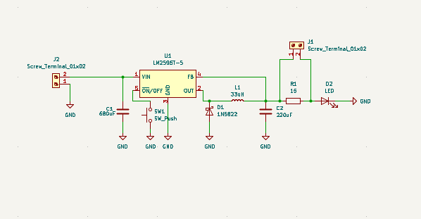
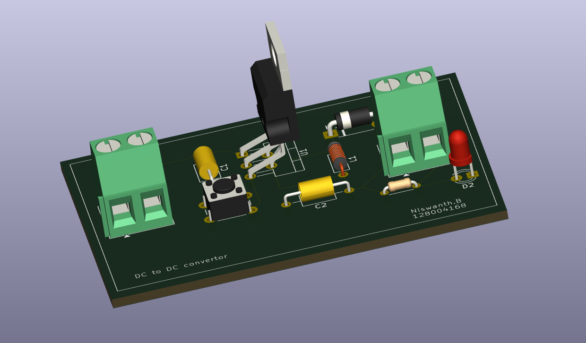
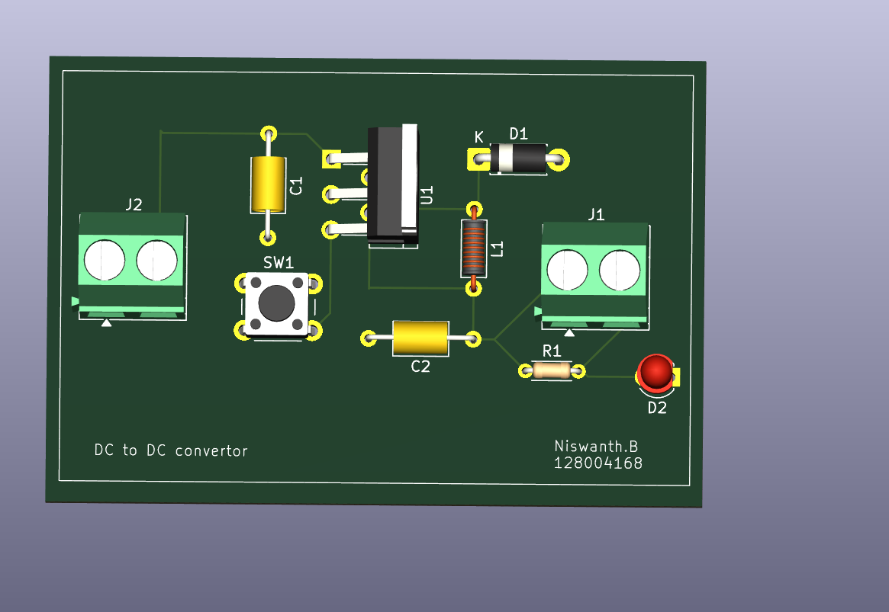
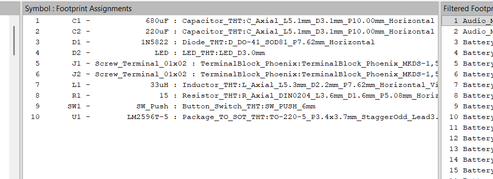
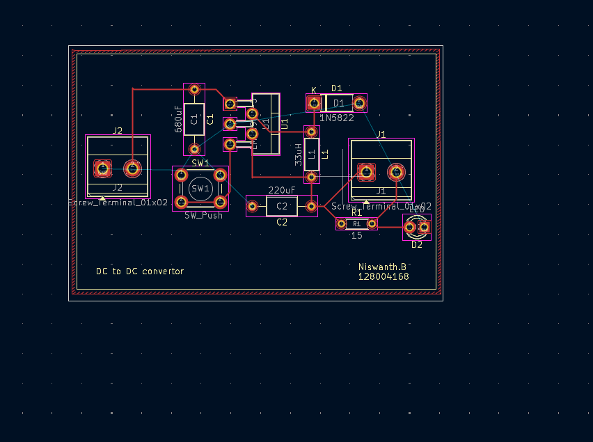

# LM2596T-5 DC to DC Buck Converter

A fixed 5V output buck converter PCB designed using KiCad as a first PCB design project.
This board steps down a higher DC voltage (7V–40V) to a stable 5V output using the
LM2596T-5 switching regulator IC.

---

## Overview

Buck converters are switching regulators that efficiently step down voltage with
minimal heat compared to linear regulators like the 7805. This design uses the
LM2596T-5, a fixed 5V variant that requires minimal external components while
delivering up to 3A of output current.

The board includes:
- An ON/OFF push button switch for manual control
- An LED power indicator with current limiting resistor
- Input and output screw terminals for easy wiring
- Flyback diode (1N5822) for protection
- Input and output filter capacitors for stable operation

---

## PCB Images

### Schematic

### 3D Tilted View

### 3D Top View

### Footprint Assignments

### PCB Editor View

---

## Schematic Overview

The circuit follows the standard LM2596 application circuit:
- **VIN** receives input from J2 screw terminal through C1 (680µF filter cap)
- **SW1** (push button) controls the ON/OFF pin of the LM2596
- **OUT** drives current through L1 (33µH inductor) to the output
- **D1** (1N5822 Schottky diode) acts as a freewheeling diode
- **C2** (220µF) filters the output voltage
- **FB** pin is tied to fixed 5V reference internally
- Output feeds J1 screw terminal with R1+D2 as a power indicator LED

---

## Components / Bill of Materials

| Ref  | Value      | Description                        | Footprint                        |
|------|------------|------------------------------------|----------------------------------|
| U1   | LM2596T-5  | Fixed 5V Buck Regulator IC         | TO-220-5, P3.4x3.7mm            |
| L1   | 33µH       | Inductor                           | Axial, L5.3mm D2.2mm P7.62mm   |
| C1   | 680µF      | Input Filter Capacitor             | Axial, L5.1mm D3.1mm P10.00mm  |
| C2   | 220µF      | Output Filter Capacitor            | Axial, L5.1mm D3.1mm P10.00mm  |
| D1   | 1N5822     | Schottky Freewheeling Diode        | DO-41, SOD81 P7.62mm            |
| D2   | LED        | Power Indicator LED                | LED_D3.0mm                      |
| R1   | 15Ω        | LED Current Limiting Resistor      | Axial, DIN0204 L3.6mm P5.08mm  |
| SW1  | SW_Push    | ON/OFF Push Button Switch          | SW_PUSH_6mm                     |
| J1   | Screw Term | Output Terminal (2-pin)            | Phoenix MKDS-1,5 2-pin          |
| J2   | Screw Term | Input Terminal (2-pin)             | Phoenix MKDS-1,5 2-pin          |

---

## Specifications

| Parameter           | Value          |
|--------------------|----------------|
| Input Voltage      | 7V – 40V DC    |
| Output Voltage     | 5V DC (Fixed)  |
| Max Output Current | Up to 3A       |
| Switching Frequency| 150kHz         |
| Efficiency         | Up to ~85%     |
| Inductor           | 33µH           |

---

## How to Use

### Input
Connect a DC power source (7V–40V) to the **J2** screw terminal:
- J2 Pin 1 → Positive (+)
- J2 Pin 2 → Negative (GND)

### Output
Connect your load to the **J1** screw terminal:
- J1 Pin 1 → 5V Output (+)
- J1 Pin 2 → Negative (GND)

### Power Switch
Press **SW1** to toggle the converter ON or OFF.
The **D2 LED** will light up when the output is active.

---

## How to Open in KiCad

1. Install [KiCad](https://www.kicad.org/) (version 9 or later recommended)
2. Clone or download this repository
3. Open `project 3.kicad_pro` in KiCad
4. Schematic is in `project 3.kicad_sch`
5. PCB layout is in `project 3.kicad_pcb`

---

## Generating Gerber Files

Gerber files are not included but can be easily generated:

1. Open `project 3.kicad_pcb` in KiCad PCB Editor
2. Go to **File → Plot**
3. Select layers: F.Cu, B.Cu, F.Silkscreen, B.Silkscreen,
   F.Mask, B.Mask, Edge.Cuts
4. Click **Plot**
5. Click **Generate Drill Files**
6. Submit output folder to your PCB manufacturer (JLCPCB, PCBWay, etc.)

---

## What I Learned

- KiCad schematic capture and PCB layout workflow
- Footprint assignment and 3D visualization
- Buck converter operating principles
- Through-hole component placement and routing
- Design rule checks (DRC) in KiCad

---

## Author

**Niswanth B**
Student ID: 128004168

*First KiCad PCB Design Project*

---

## License

This project is open source under the [MIT License](LICENSE).
Feel free to use, modify, and learn from it.
